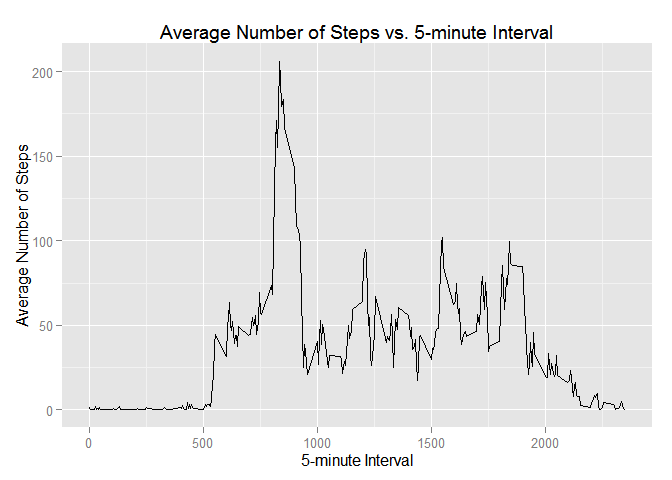
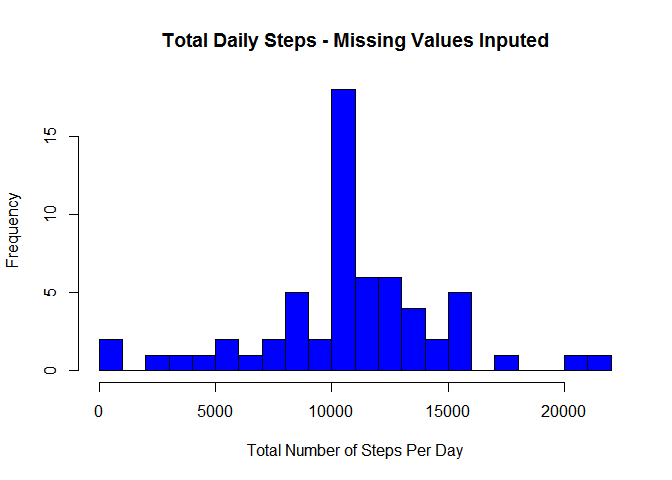

# Reproducible Research: Peer Assessment 1


## Loading and preprocessing the data

```r
library(dplyr)
```

```
## 
## Attaching package: 'dplyr'
## 
## The following objects are masked from 'package:stats':
## 
##     filter, lag
## 
## The following objects are masked from 'package:base':
## 
##     intersect, setdiff, setequal, union
```

```r
data <- tbl_df(read.csv(unz("activity.zip", "activity.csv")))
head(data)
```

```
## Source: local data frame [6 x 3]
## 
##   steps       date interval
##   (int)     (fctr)    (int)
## 1    NA 2012-10-01        0
## 2    NA 2012-10-01        5
## 3    NA 2012-10-01       10
## 4    NA 2012-10-01       15
## 5    NA 2012-10-01       20
## 6    NA 2012-10-01       25
```
There are three columns of data per observation. 

1. number of steps  
1. date of the observation  
1. Observation-minute label of th 5-minute interval (0, 5, 10 ...)

## What is mean total number of steps taken per day?

```r
stepdata <- data %>% 
     group_by(date) %>% 
     summarize(total_steps = sum(steps, na.rm=TRUE))
head(stepdata)
```

```
## Source: local data frame [6 x 2]
## 
##         date total_steps
##       (fctr)       (int)
## 1 2012-10-01           0
## 2 2012-10-02         126
## 3 2012-10-03       11352
## 4 2012-10-04       12116
## 5 2012-10-05       13294
## 6 2012-10-06       15420
```

```r
hist(stepdata$total_steps, 
     breaks=20, 
     main="Total Daily Steps", 
     xlab="Total Number of Steps Per Day",
     col="blue")
```

 

```r
rbind(mean = mean(stepdata$total_steps, na.rm = TRUE), 
      median = median(stepdata$total_steps, na.rm = TRUE))
```

```
##            [,1]
## mean    9354.23
## median 10395.00
```


## What is the average daily activity pattern?
1. Make a time series plot (i.e. type = "l") of the 5-minute interval (x-axis) and the average number of steps taken, averaged across all days (y-axis)

```r
library(ggplot2)
intervalData <- data %>%
     group_by(interval) %>%
     summarize(intAve = mean(steps, na.rm = TRUE))
head(intervalData)
```

```
## Source: local data frame [6 x 2]
## 
##   interval    intAve
##      (int)     (dbl)
## 1        0 1.7169811
## 2        5 0.3396226
## 3       10 0.1320755
## 4       15 0.1509434
## 5       20 0.0754717
## 6       25 2.0943396
```

```r
g = ggplot(intervalData, aes(x=interval, y=intAve)) +
     geom_line() +
     xlab("Interval") + 
     ylab("Number of Steps") +
     ggtitle("Average Interval Steps")
g
```

 

2. Which 5-minute interval, on average across all the days in the dataset, contains the maximum number of steps?

```r
intervalData[which.max(intervalData$intAve),]
```

```
## Source: local data frame [1 x 2]
## 
##   interval   intAve
##      (int)    (dbl)
## 1      835 206.1698
```
From this we see (and is corroborated by the figure above) that the max of 206.2 steps was earned
during the 5-minute interval that began at 0835.


## Imputing missing values

Note that there are a number of days/intervals where there are missing values (coded as NA). The presence of missing days may introduce bias into some calculations or summaries of the data.

1. Calculate and report the total number of missing values in the dataset (i.e. the total number of rows with NAs)

```r
sum(is.na(data$steps))
```

```
## [1] 2304
```

2. Devise a strategy for filling in all of the missing values in the dataset. The strategy does not need to be sophisticated. For example, you could use the mean/median for that day, or the mean for that 5-minute interval, etc.

Since people's daily schedules are not synchronized down to 5-minute intervals, i will not use
the mean 5-minute step count for the corresponding interval for the gap-fil. To be slightly conservative, I will instead use the mean 5-minute stepcount for the entire data set. 

3. Create a new dataset that is equal to the original dataset but with the missing data filled in.

```r
dataNew <- data %>% 
     transmute(steps = ifelse(is.na(steps), mean(steps, na.rm=TRUE), steps), date, interval)
head(dataNew)
```

```
## Source: local data frame [6 x 3]
## 
##     steps       date interval
##     (dbl)     (fctr)    (int)
## 1 37.3826 2012-10-01        0
## 2 37.3826 2012-10-01        5
## 3 37.3826 2012-10-01       10
## 4 37.3826 2012-10-01       15
## 5 37.3826 2012-10-01       20
## 6 37.3826 2012-10-01       25
```

```r
sum(is.na(dataNew$steps))
```

```
## [1] 0
```

4. Make a histogram of the total number of steps taken each day and Calculate and report the mean and median total number of steps taken per day. Do these values differ from the estimates from the first part of the assignment? What is the impact of imputing missing data on the estimates of the total daily number of steps?

```r
stepdataNew <- dataNew %>% 
     group_by(date) %>% 
     summarize(total_steps = sum(steps))
head(stepdataNew)
```

```
## Source: local data frame [6 x 2]
## 
##         date total_steps
##       (fctr)       (dbl)
## 1 2012-10-01    10766.19
## 2 2012-10-02      126.00
## 3 2012-10-03    11352.00
## 4 2012-10-04    12116.00
## 5 2012-10-05    13294.00
## 6 2012-10-06    15420.00
```

```r
hist(stepdataNew$total_steps, 
     breaks=20, 
     main="Total Daily Steps - with gap-filling", 
     xlab="Total Number of Steps Per Day",
     col="blue")
```

 

```r
rbind(mean = mean(stepdataNew$total_steps), 
      median = median(stepdataNew$total_steps))
```

```
##            [,1]
## mean   10766.19
## median 10766.19
```
Interestingly the mean and median are the same. Both are larger than from the originla data, which is not suprsising since we've added values where there were none, which could only increase the daily totals.

## Are there differences in activity patterns between weekdays and weekends?
For this part the weekdays() function may be of some help here. Use the dataset with the filled-in missing values for this part.

1. Create a new factor variable in the dataset with two levels – “weekday” and “weekend” indicating whether a given date is a weekday or weekend day.

```r
dataNew <- dataNew %>% 
     mutate(dayType = 
                 as.factor(ifelse(as.POSIXlt(date)$wday < 6 & as.POSIXlt(date)$wday > 0, 
                        "weekday", "weekend"))
            )
head(dataNew)
```

```
## Source: local data frame [6 x 4]
## 
##     steps       date interval dayType
##     (dbl)     (fctr)    (int)  (fctr)
## 1 37.3826 2012-10-01        0 weekday
## 2 37.3826 2012-10-01        5 weekday
## 3 37.3826 2012-10-01       10 weekday
## 4 37.3826 2012-10-01       15 weekday
## 5 37.3826 2012-10-01       20 weekday
## 6 37.3826 2012-10-01       25 weekday
```

2. Make a panel plot containing a time series plot (i.e. type = "l") of the 5-minute interval (x-axis) and the average number of steps taken, averaged across all weekday days or weekend days (y-axis). See the README file in the GitHub repository to see an example of what this plot should look like using simulated data.


```r
library(ggplot2)
intervalDataNew <- dataNew %>%
     group_by(dayType, interval) %>%
     summarize(intAve = mean(steps))

g = ggplot(intervalDataNew, aes(x=interval, y=intAve)) +
     geom_line() +
     facet_grid(dayType ~ .) +
     xlab("Interval") + 
     ylab("Number of Steps") +
     ggtitle("Average Interval Steps")
g
```

 

From this, it appears that the wearer wakes up later and slower on weekends. It also appears that the wearer goes to bed later on weekends as well. 
